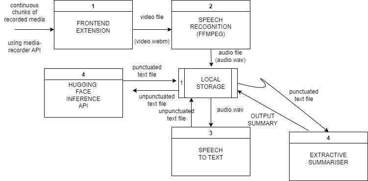

# VIDEO TRANCRIPTION AND SUMMARIZATION 

## OBJECTIVE
The objective of this project is to develop an NLP system that can automatically record online meetings, webinars, and videos and generate a summary of the content in text format. The system should be able to summarize the webinar accurately and efficiently, so that the people who missed the webinar can get a gist of all the important things that happened in the meet. Added to this, those people who did attend the meeting can also refer to the summary some time later in order to review the important things. The system should also be able to identify and highlight any important keywords or phrases that are relevant to the discussion.

## TECHNOLOGY USED
### FRONTEND
<ul><li>HTML</li>
<li> CSS </li>
<li> Javascript </li>
</ul>

### BACKEND
<ul><li>Python - NLTK,SOCKETIO,VOSK</li>
<li>Flask</li></ul>

## MODELS USED
<ul><li>FFMPEG</li>
<li>VOSK SPEECH2TEXT</li>
<li>HUGGING FACE INFERENCE API</li>
<li>EXTRACTIVE SUMMARIZATION - Frequency based approach and TextRank Algorithm</li>

## DATA FLOW DIAGRAM

    

<b> For more details refer to the documentation provided in the `resources` directory.</b>

<b> In order to setup the system on your local computer, refer to `README.md` in the `server` directory.</b>

